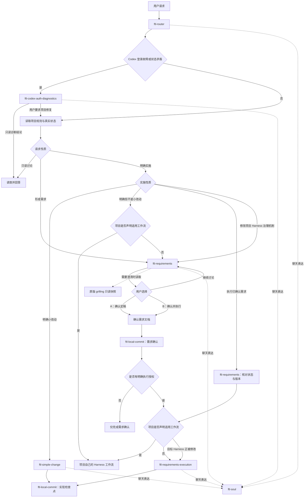

# FTLSoul Skills

FTLSoul 是一个按单一职责组织的用户级 Agent Skill 仓库。它运行在具体项目 Harness 之外，负责通用的任务分类、需求澄清、执行授权和回退执行；进入项目后先读取并尊重项目实际声明的规则，不把 FTLSoul 角色或生命周期描述成项目 Harness 的组成部分。

本仓库的 `AGENTS.md` 只负责指向 `ftl-router`；路由器判断请求性质和授权边界，具体纪律放在独立 Skill 中。可直接进入的工作流 Skill 都显式使用 `ftl-soul` 处理面向用户的聊天表达。

## Skill 目录

| Skill | 职责 | 调用方式 |
| --- | --- | --- |
| `ftl-router` | 区分只读讨论、形成需求和明确实施，并选择项目工作流或全局回退路线 | 本仓库的编排入口，也可显式调用 |
| `ftl-codex-auth-diagnostics` | 区分真正缺少登录、选错 Codex CLI 与 Windows 安全身份或凭据上下文隔离 | 由路由器在 Codex 登录失败或状态矛盾时选择，也可直接匹配 |
| `ftl-simple-change` | 实施未被项目专用工作流接管的明确小改动 | 由路由器选择，也可直接匹配 |
| `ftl-requirements` | 澄清、记录和确认复杂需求，并选择实际执行器 | 由路由器选择，也可直接匹配 |
| `ftl-requirements-execution` | 在没有适用项目工作流或目标 Harness 正被修改时执行已确认需求 | 由需求流程交接，也可直接匹配 |
| `ftl-local-commit` | 安全创建由上游业务 Skill 定义的本地提交 | 由需要提交的业务 Skill 调用 |
| `ftl-soul` | 调整任务全程的聊天表达与猫娘口吻 | 由可直接进入的工作流 Skill 调用 |



三条顶层路线按用户当前意图区分。项目话题、计划是否具体、是否存在设计取舍都不会自动把普通讨论升级成需求流程：自由探讨保持只读；只有用户明确希望形成后续工作依据或维护需求文档时才进入 `ftl-requirements`；明确实施后再按范围选择小改动、项目工作流或已确认需求执行。

Codex CLI、Codex App Server 或依赖它们的项目报告 `Not logged in`、要求设备码授权、出现宿主与 Agent 登录状态矛盾或疑似选错 CLI 时，路由器先调用 `ftl-codex-auth-diagnostics`。该 Skill 只读比较可执行文件、版本、Windows 安全身份、配置环境和凭据元数据；它不会读取凭据内容、自动登录或把沙箱中的未登录状态直接解释为用户未登录。

`ftl-requirements` 需要共同决定需求内容时，会读取其内部的原版 `grilling` 快照，用决策树和 frontier 分轮访谈。该快照来自 `mattpocock/skills` 的 commit `85f83d3fde1d3a90d5c9a657f6998c79a6c37308`，内容保持原样并附带 MIT 许可证通知；它不是独立 Skill 或顶层路由。访谈完成、需求确认和实施授权仍是三个不同事件。

图中的“项目自己的 Harness 工作流”属于目标项目，不属于 FTLSoul。项目存在 `AGENTS.md`、测试或某类文档并不自动证明存在适用执行器；只有项目规则和真实入口明确承担当前任务时才交接。项目 Harness 治理机制本身是修改对象时，全局执行器保留在目标规则之外，避免要求旧规则吸收或批准自己的替代方案。

`ftl-router` 是推荐的统一入口，但公开工作流被直接匹配时仍会显式使用 `ftl-soul`，避免表达规则依赖单一路径。猫娘表达的规则只维护在 `ftl-soul`；其他 Skill 只保留调用指针。它处理 commentary、澄清问题、状态更新和最终回复，不改写需求文档、代码、命令、结构化数据或提交信息。

所有 Skill（包括路由器）都位于自己的目录并拥有独立 `SKILL.md`。上游业务 Skill 决定为什么提交、何时提交以及提交哪些内容，`ftl-local-commit` 只负责安全完成该本地提交。依赖保持单向，避免循环调用；没有真实用途的共享目录、占位资源和停用模块不进入仓库。

## 生成文档

`ftl-requirements` 新建的需求文档统一写入 `docs/ftl/requirements/`，文件名使用 `YYYY-MM-DD-简短标题.md`。只有用户在当前请求中明确指定其他位置时才改变新文档路径；项目自定义目录不会覆盖这项全局约定。既有需求文档继续原地维护，不会因目录规范更新而被自动迁移或重命名。

新文档的默认生命周期是`编辑中`、`已确认`和`执行完毕`。项目可以声明额外状态和工作流；FTLSoul 只在当前任务实际适用时遵循，不把某个项目的规划、吸收或评估结构推广到其他项目。

## VS Code 一键 AI Commit

仓库提供 `FTL: AI 分析并提交` 构建任务。在 VS Code 中按 `Ctrl+Shift+B` 即可启动，也可以从“终端 → 运行任务”中选择它。

任务会调用本机已经登录的 Codex CLI：AI 先读取项目规则，审阅 staged、unstaged 和 untracked 变更，检查敏感内容与提交边界，运行项目实际支持的相称验证，再返回精确路径和 Conventional Commit 信息。脚本确认分析期间仓库没有发生变化后，才按 AI 计划暂存并创建一个本地 commit。

使用前需要：

- `git` 和 `codex` 已加入 `PATH`；
- 已执行 `codex login`；
- 当前目录是 Git 仓库，且没有冲突、rebase、merge、cherry-pick 等进行中的操作。

脚本不会 push、merge、改写历史或自动清理工作区。若变更无法组成一个安全且完整的提交、验证失败、存在混杂改动，或者 AI 分析期间文件又发生变化，它会停止而不是勉强提交。需要预览 AI 计划但不落 commit 时，可以在终端运行：

```powershell
powershell -NoProfile -ExecutionPolicy Bypass -File scripts/ai-commit.ps1 -WhatIf
```

## 来源迁移

本结构由 `FTLNekoNekoSkill/skill` 拆分而来。迁移只读取当前有效版本；`.ftlmind/` 历史与缓存、以及已经停用的 `unslop-output.md` 没有迁入。原仓库保留不动，便于迁移结果核对。
